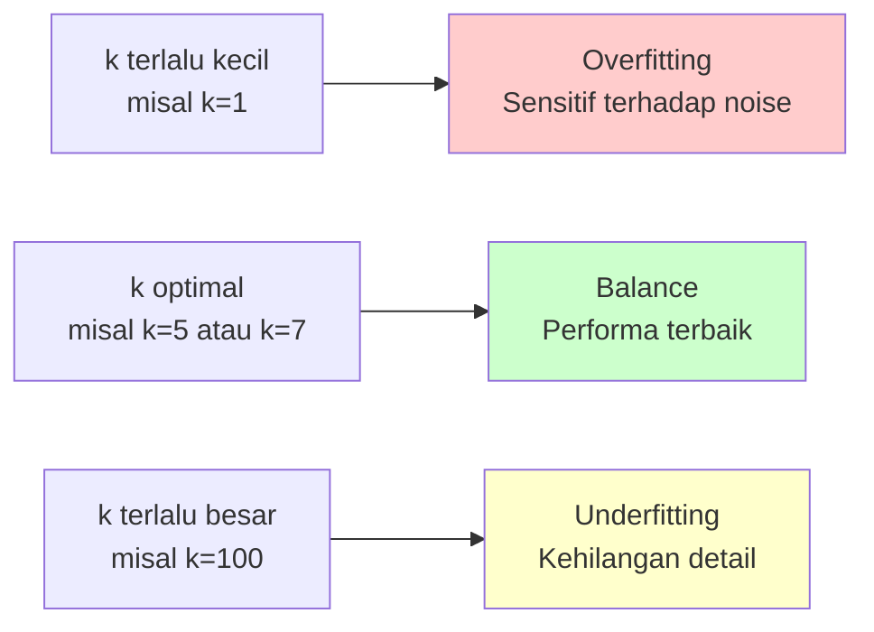
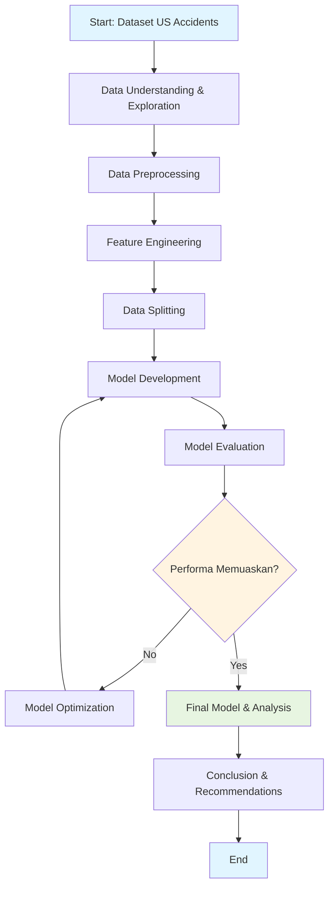

# PROPOSAL PENELITIAN

## OPTIMISASI MODEL K-NEAREST NEIGHBORS (KNN) DALAM MEMPREDIKSI TINGKAT KECELAKAAN LALU LINTAS

---

### Peneliti:
**[Nama Mahasiswa]**  
**NIM: [Nomor Induk Mahasiswa]**  
**Program Studi Informatika**  
**[Nama Universitas]**  
**Tahun [2026]**

---

## BAB 1: PENDAHULUAN

### 1.1 Latar Belakang

Kecelakaan lalu lintas merupakan salah satu penyebab utama kematian dan cedera di seluruh dunia. Menurut World Health Organization (WHO), sekitar 1,35 juta orang meninggal setiap tahun akibat kecelakaan lalu lintas. Di Amerika Serikat sendiri, National Highway Traffic Safety Administration (NHTSA) mencatat bahwa kecelakaan lalu lintas menyebabkan kerugian ekonomi yang signifikan setiap tahunnya.

Prediksi tingkat kecelakaan lalu lintas menjadi sangat penting untuk membantu pihak berwenang dalam mengambil keputusan proaktif, seperti peningkatan pengawasan di area rawan kecelakaan, perbaikan infrastruktur jalan, dan implementasi kebijakan keselamatan yang lebih efektif. Dengan kemampuan memprediksi tingkat kecelakaan secara akurat, dapat dilakukan tindakan preventif yang tepat untuk mengurangi angka kecelakaan.

Machine learning telah menjadi pendekatan yang populer dalam analisis dan prediksi data kompleks, termasuk prediksi kecelakaan lalu lintas. Salah satu algoritma machine learning yang sering digunakan adalah **K-Nearest Neighbors (KNN)**. Algoritma KNN merupakan metode klasifikasi yang sederhana namun efektif, yang bekerja dengan cara mencari k-tetangga terdekat dari data yang akan diprediksi dan menentukan kelas berdasarkan mayoritas kelas dari tetangga-tetangga tersebut.

Meskipun KNN memiliki keunggulan dalam kesederhanaan implementasi dan tidak memerlukan fase training yang kompleks, algoritma ini memiliki beberapa kelemahan, antara lain:
1. **Sensitif terhadap pemilihan nilai k** - Nilai k yang tidak optimal dapat menurunkan akurasi prediksi
2. **Komputasi yang lambat** pada dataset besar karena harus menghitung jarak ke semua data training
3. **Sensitif terhadap fitur yang tidak relevan** - Fitur yang tidak penting dapat mempengaruhi perhitungan jarak
4. **Masalah pada data yang tidak seimbang (imbalanced data)** - KNN cenderung bias terhadap kelas mayoritas

Untuk mengatasi kelemahan-kelemahan tersebut, diperlukan **optimisasi model KNN** yang dapat meningkatkan performa prediksi. Optimisasi dapat dilakukan melalui beberapa pendekatan, seperti:
- **Feature selection** untuk memilih fitur yang paling relevan
- **Hyperparameter tuning** untuk menemukan nilai k optimal
- **Normalisasi data** untuk menyamakan skala antar fitur
- **Weighted KNN** untuk memberikan bobot berbeda pada tetangga berdasarkan jaraknya
- **Teknik sampling** untuk menangani data yang tidak seimbang

Penelitian ini akan menggunakan dataset **US Accidents (2016-2023)** dari Kaggle yang berisi lebih dari 7,7 juta record kecelakaan lalu lintas di Amerika Serikat. Dataset ini sangat komprehensif dengan berbagai fitur seperti kondisi cuaca, waktu, lokasi, dan kondisi jalan yang dapat digunakan untuk membangun model prediksi yang akurat.

### 1.2 Rumusan Masalah

Berdasarkan latar belakang di atas, rumusan masalah dalam penelitian ini adalah:

1. Bagaimana pengaruh pemilihan fitur (feature selection) terhadap akurasi model KNN dalam memprediksi tingkat kecelakaan lalu lintas?
2. Bagaimana menentukan nilai k optimal untuk meningkatkan performa model KNN pada dataset US Accidents?
3. Bagaimana performa model KNN yang telah dioptimasi dibandingkan dengan model KNN baseline tanpa optimisasi?
4. Fitur-fitur apa saja yang paling berpengaruh terhadap prediksi tingkat kecelakaan lalu lintas?

### 1.3 Tujuan Penelitian

Tujuan dari penelitian ini adalah:

1. Menganalisis pengaruh pemilihan fitur terhadap akurasi model KNN dalam prediksi tingkat kecelakaan
2. Menentukan nilai k optimal melalui hyperparameter tuning untuk meningkatkan performa model
3. Membandingkan performa model KNN yang telah dioptimasi dengan model baseline
4. Mengidentifikasi fitur-fitur penting yang mempengaruhi tingkat kecelakaan lalu lintas
5. Mengembangkan model prediksi tingkat kecelakaan yang akurat dan dapat digunakan sebagai alat bantu pengambilan keputusan

### 1.4 Manfaat Penelitian

Manfaat yang diharapkan dari penelitian ini adalah:

#### 1.4.1 Manfaat Teoritis
- Memberikan kontribusi pada pengembangan ilmu pengetahuan, khususnya dalam bidang machine learning dan data mining
- Memperkaya literatur mengenai optimisasi algoritma KNN untuk kasus prediksi kecelakaan lalu lintas
- Memberikan pemahaman lebih dalam tentang faktor-faktor yang mempengaruhi tingkat kecelakaan

#### 1.4.2 Manfaat Praktis
- **Bagi Pemerintah/Dinas Perhubungan**: Model prediksi dapat membantu dalam perencanaan kebijakan keselamatan lalu lintas dan alokasi sumber daya untuk pengawasan jalan
- **Bagi Masyarakat**: Meningkatkan kesadaran tentang faktor-faktor risiko kecelakaan sehingga dapat lebih berhati-hati dalam berkendara
- **Bagi Peneliti Selanjutnya**: Hasil penelitian dapat menjadi referensi untuk pengembangan model prediksi yang lebih baik di masa depan

### 1.5 Batasan Masalah

Untuk memfokuskan penelitian, ditetapkan batasan masalah sebagai berikut:

1. Dataset yang digunakan adalah US Accidents (2016-2023) dari Kaggle dengan URL: https://www.kaggle.com/datasets/sobhanmoosavi/us-accidents/data
2. Algoritma yang digunakan adalah K-Nearest Neighbors (KNN) dengan berbagai teknik optimisasi
3. Target prediksi adalah tingkat keparahan kecelakaan (severity level)
4. Teknik optimisasi yang diterapkan meliputi: feature selection, hyperparameter tuning, normalisasi data, dan handling imbalanced data
5. Evaluasi model menggunakan metrik: accuracy, precision, recall, F1-score, dan confusion matrix
6. Implementasi menggunakan bahasa pemrograman Python dengan library scikit-learn
7. Penelitian tidak mencakup analisis real-time atau deployment model ke sistem produksi

#### 1.5.1 Kontribusi dan Novelty Penelitian

Penelitian ini memberikan kontribusi ilmiah yang spesifik:

**A. Kontribusi Metodologis:**
- **Framework Optimisasi Holistik**: Kombinasi sistematis dari 4 teknik optimisasi (feature selection + hyperparameter tuning + normalisasi + handling imbalanced data) yang diterapkan secara bersamaan pada KNN untuk kasus prediksi kecelakaan
- **Benchmark Comprehensive**: Evaluasi mendalam KNN pada dataset skala besar (7,7+ juta records) yang belum banyak dilakukan pada penelitian sebelumnya

**B. Kontribusi Praktis:**
- **Feature Insights**: Identifikasi faktor-faktor kunci yang mempengaruhi tingkat keparahan kecelakaan berdasarkan data real-world yang dapat digunakan untuk policy making
- **Model Interpretable**: Model yang tidak hanya akurat tetapi juga dapat dijelaskan (interpretable), penting untuk pengambilan keputusan oleh stakeholder non-teknis

**C. Kontribusi Akademis:**
- **Studi Komparatif**: Analisis mendalam tentang trade-off antara berbagai teknik optimisasi pada KNN
- **Gap Filling**: Mengisi kesenjangan penelitian antara optimisasi algoritma KNN dan aplikasi prediksi kecelakaan pada dataset berskala besar

**D. Novelty (Kebaruan):**
- Belum ada penelitian yang secara komprehensif mengoptimasi KNN dengan kombinasi multiple techniques untuk prediksi kecelakaan pada US Accidents dataset
- Pendekatan systematic comparison dari 6+ skenario optimisasi yang berbeda
- Analisis interpretability yang mendalam menggunakan SHAP values untuk KNN pada domain transportasi


### 1.6 Sistematika Penulisan

Sistematika penulisan proposal penelitian ini adalah sebagai berikut:

**BAB 1 PENDAHULUAN**  
Berisi latar belakang, rumusan masalah, tujuan penelitian, manfaat penelitian, batasan masalah, dan sistematika penulisan.

**BAB 2 TINJAUAN PUSTAKA**  
Berisi teori-teori yang mendukung penelitian, meliputi: kecelakaan lalu lintas, machine learning, algoritma KNN, teknik optimisasi, evaluasi model, dan penelitian terdahulu yang relevan.

**BAB 3 METODE PENELITIAN**  
Berisi metode yang akan digunakan dalam penelitian, meliputi: jenis penelitian, sumber data, tahapan penelitian, preprocessing data, desain eksperimen, teknik optimisasi, dan evaluasi model.

**BAB 4 HASIL DAN PEMBAHASAN**  
Berisi hasil eksperimen semua skenario optimisasi, analisis performa model (accuracy, precision, recall, F1-score), perbandingan hasil antara baseline dan optimized model, visualisasi confusion matrix dan ROC curves, analisis feature importance, error analysis, dan pembahasan mendalam tentang temuan penelitian serta implikasinya untuk keselamatan lalu lintas.

**BAB 5 PENUTUP**  
Berisi kesimpulan dari penelitian yang menjawab semua rumusan masalah, keterbatasan penelitian, dan saran untuk penelitian selanjutnya (misalnya: menggunakan algoritma lain, real-time prediction, deployment ke sistem produksi).

---

## BAB 2: TINJAUAN PUSTAKA

### 2.1 Kecelakaan Lalu Lintas

#### 2.1.1 Definisi Kecelakaan Lalu Lintas

Kecelakaan lalu lintas adalah kejadian yang terjadi di jalan raya yang melibatkan satu atau lebih kendaraan, yang dapat menyebabkan kerusakan kendaraan, cedera, atau kematian. Menurut Undang-Undang Republik Indonesia Nomor 22 Tahun 2009 tentang Lalu Lintas dan Angkutan Jalan, kecelakaan lalu lintas adalah suatu peristiwa di jalan yang tidak diduga dan tidak disengaja melibatkan kendaraan dengan atau tanpa pengguna jalan lain yang mengakibatkan korban manusia dan/atau kerugian harta benda.

#### 2.1.2 Faktor-Faktor Penyebab Kecelakaan

Kecelakaan lalu lintas disebabkan oleh berbagai faktor yang dapat dikategorikan menjadi:

1. **Faktor Manusia (Human Factors)**
   - Kelelahan pengemudi
   - Pengaruh alkohol atau obat-obatan
   - Kecepatan berlebihan
   - Pelanggaran rambu lalu lintas
   - Kurangnya pengalaman mengemudi
   - Gangguan/distraksi (misalnya penggunaan handphone)

2. **Faktor Kendaraan (Vehicle Factors)**
   - Kondisi rem yang tidak baik
   - Ban yang tidak layak pakai
   - Sistem pencahayaan yang rusak
   - Kurangnya perawatan kendaraan

3. **Faktor Lingkungan (Environmental Factors)**
   - Kondisi cuaca (hujan, kabut, salju)
   - Kondisi jalan (lubang, jalan licin)
   - Visibilitas yang rendah
   - Waktu (malam hari lebih berisiko)
   - Kondisi lalu lintas (kemacetan)

#### 2.1.3 Tingkat Keparahan Kecelakaan

Tingkat keparahan kecelakaan umumnya dikategorikan menjadi beberapa level:
- **Severity 1**: Kecelakaan sangat serius dengan dampak jangka panjang pada lalu lintas
- **Severity 2**: Kecelakaan serius yang mempengaruhi lalu lintas
- **Severity 3**: Kecelakaan sedang dengan dampak terbatas
- **Severity 4**: Kecelakaan ringan dengan dampak minimal

### 2.2 Machine Learning

#### 2.2.1 Definisi Machine Learning

Machine learning adalah cabang dari artificial intelligence (AI) yang memberikan kemampuan kepada komputer untuk belajar dari data tanpa harus diprogram secara eksplisit. Machine learning menggunakan algoritma untuk menganalisis data, belajar dari data tersebut, dan membuat prediksi atau keputusan berdasarkan pola yang ditemukan.

#### 2.2.2 Jenis-Jenis Machine Learning

Machine learning dapat dibagi menjadi tiga kategori utama:

1. **Supervised Learning (Pembelajaran Terawasi)**
   - Model belajar dari data yang sudah berlabel
   - Tujuan: memprediksi output untuk input baru
   - Contoh: klasifikasi, regresi
   - Algoritma: KNN, Decision Tree, SVM, Neural Networks

2. **Unsupervised Learning (Pembelajaran Tidak Terawasi)**
   - Model belajar dari data tanpa label
   - Tujuan: menemukan pola atau struktur dalam data
   - Contoh: clustering, dimensionality reduction
   - Algoritma: K-Means, PCA, Hierarchical Clustering

3. **Reinforcement Learning (Pembelajaran Penguatan)**
   - Model belajar melalui trial and error dengan sistem reward
   - Tujuan: memaksimalkan reward
   - Contoh: game playing, robotics

#### 2.2.3 Aplikasi Machine Learning

Machine learning telah diterapkan dalam berbagai bidang:
- **Healthcare**: Diagnosis penyakit, prediksi risiko kesehatan
- **Finance**: Deteksi fraud, credit scoring
- **Transportation**: Prediksi kecelakaan, autonomous vehicles
- **E-commerce**: Recommendation systems, customer churn prediction
- **Social Media**: Sentiment analysis, content recommendation

### 2.3 Algoritma K-Nearest Neighbors (KNN)

#### 2.3.1 Definisi dan Konsep Dasar KNN

K-Nearest Neighbors (KNN) adalah algoritma supervised learning yang dapat digunakan untuk klasifikasi maupun regresi. Algoritma ini bekerja berdasarkan prinsip "kedekatan", yaitu suatu data akan diklasifikasikan berdasarkan kelas mayoritas dari k-tetangga terdekatnya.

**Prinsip Kerja KNN:**
1. Tentukan nilai k (jumlah tetangga yang akan dipertimbangkan)
2. Hitung jarak antara data baru dengan semua data training
3. Urutkan jarak dari yang terkecil hingga terbesar
4. Ambil k data dengan jarak terdekat
5. Untuk klasifikasi: tentukan kelas berdasarkan voting mayoritas dari k-tetangga
6. Untuk regresi: hitung rata-rata nilai dari k-tetangga

**Ilustrasi Konsep KNN:**

```
Contoh: Prediksi kelas untuk data baru (?) dengan k=3

        Kelas A (■)    Kelas B (●)    Data Baru (?)
        
        ■              ●
              ■               ?
        ●         ●
                    ■
        
Langkah:
1. Hitung jarak dari ? ke semua titik
2. Ambil 3 tetangga terdekat (k=3)
3. Hasil: 2 dari Kelas A, 1 dari Kelas B
4. Prediksi: Kelas A (mayoritas voting)
```

**Visualisasi Pengaruh Nilai k:**



#### 2.3.2 Fungsi Jarak dalam KNN

Perhitungan jarak adalah komponen penting dalam KNN. Beberapa metrik jarak yang umum digunakan:

1. **Euclidean Distance (Jarak Euclidean)**
   ```
   d(x,y) = √(Σ(xi - yi)²)
   ```
   - Paling umum digunakan
   - Cocok untuk data kontinu
   - Sensitif terhadap perbedaan skala

2. **Manhattan Distance (Jarak Manhattan)**
   ```
   d(x,y) = Σ|xi - yi|
   ```
   - Cocok untuk data dengan dimensi tinggi
   - Lebih robust terhadap outlier

3. **Minkowski Distance**
   ```
   d(x,y) = (Σ|xi - yi|^p)^(1/p)
   ```
   - Generalisasi dari Euclidean (p=2) dan Manhattan (p=1)

4. **Hamming Distance**
   - Digunakan untuk data kategorikal
   - Menghitung jumlah posisi di mana nilai berbeda

#### 2.3.3 Kelebihan dan Kekurangan KNN

**Kelebihan:**
- Sederhana dan mudah dipahami
- Tidak memerlukan fase training yang kompleks
- Efektif untuk data dengan batas keputusan non-linear
- Dapat digunakan untuk klasifikasi dan regresi
- Tidak membuat asumsi tentang distribusi data

**Kekurangan:**
- Komputasi lambat pada dataset besar (lazy learning)
- Memerlukan banyak memori untuk menyimpan semua data training
- Sensitif terhadap pemilihan nilai k
- Sensitif terhadap fitur yang tidak relevan
- Performa menurun pada data dengan dimensi tinggi (curse of dimensionality)
- Tidak robust terhadap data yang tidak seimbang (imbalanced data)

### 2.4 Teknik Optimisasi Model KNN

#### 2.4.1 Feature Selection (Seleksi Fitur)

Feature selection adalah proses memilih subset fitur yang paling relevan untuk meningkatkan performa model. Manfaat feature selection:
- Mengurangi overfitting
- Mempercepat waktu training dan prediksi
- Meningkatkan akurasi model
- Memudahkan interpretasi model

**Metode Feature Selection:**

1. **Filter Methods**
   - Chi-Square Test
   - Correlation Coefficient
   - Information Gain
   - Variance Threshold

2. **Wrapper Methods**
   - Recursive Feature Elimination (RFE)
   - Forward Selection
   - Backward Elimination

3. **Embedded Methods**
   - LASSO (L1 Regularization)
   - Decision Tree-based feature importance
   - Random Forest feature importance

#### 2.4.2 Hyperparameter Tuning

Hyperparameter tuning adalah proses mencari kombinasi hyperparameter terbaik untuk meningkatkan performa model. Untuk KNN, hyperparameter yang dapat di-tune:

1. **Nilai k (Number of Neighbors)**
   - Nilai k yang terlalu kecil: model overfitting, sensitif terhadap noise
   - Nilai k yang terlalu besar: model underfitting, kehilangan detail
   - Aturan umum: k = √n (n = jumlah data training)

2. **Metrik Jarak (Distance Metric)**
   - Euclidean, Manhattan, Minkowski
   - Pemilihan bergantung pada karakteristik data

3. **Weights (Bobot)**
   - Uniform: semua tetangga memiliki bobot sama
   - Distance: tetangga lebih dekat memiliki bobot lebih besar

**Teknik Hyperparameter Tuning:**

1. **Grid Search**
   - Mencoba semua kombinasi hyperparameter yang ditentukan
   - Exhaustive search, menjamin menemukan kombinasi terbaik
   - Komputasi mahal pada ruang pencarian yang besar

2. **Random Search**
   - Sampling acak dari distribusi hyperparameter
   - Lebih efisien daripada grid search
   - Tidak menjamin menemukan kombinasi optimal

3. **Bayesian Optimization**
   - Menggunakan probabilitas untuk memilih hyperparameter berikutnya
   - Lebih efisien daripada grid dan random search
   - Cocok untuk ruang pencarian yang besar

#### 2.4.3 Normalisasi Data

Normalisasi adalah proses mengubah skala fitur agar berada dalam rentang yang sama. Ini penting untuk KNN karena algoritma ini sensitif terhadap skala fitur.

**Teknik Normalisasi:**

1. **Min-Max Scaling (Normalization)**
   ```
   x' = (x - min(x)) / (max(x) - min(x))
   ```
   - Mengubah data ke rentang [0, 1]
   - Sensitif terhadap outlier

2. **Standardization (Z-score Normalization)**
   ```
   x' = (x - mean(x)) / std(x)
   ```
   - Mengubah data dengan mean=0 dan std=1
   - Lebih robust terhadap outlier

3. **Robust Scaling**
   ```
   x' = (x - median(x)) / IQR(x)
   ```
   - Menggunakan median dan IQR (Interquartile Range)
   - Sangat robust terhadap outlier

#### 2.4.4 Handling Imbalanced Data

Imbalanced data terjadi ketika distribusi kelas tidak seimbang. KNN cenderung bias terhadap kelas mayoritas. Teknik untuk menangani imbalanced data:

1. **Resampling Methods**
   - **Oversampling**: menambah data kelas minoritas
     - Random Oversampling
     - SMOTE (Synthetic Minority Over-sampling Technique)
     - ADASYN (Adaptive Synthetic Sampling)
   
   - **Undersampling**: mengurangi data kelas mayoritas
     - Random Undersampling
     - Tomek Links
     - NearMiss

2. **Algorithmic Approaches**
   - **Weighted KNN**: memberikan bobot lebih tinggi pada kelas minoritas
   - **Cost-sensitive Learning**: memberikan penalty cost berbeda untuk misclassification

3. **Ensemble Methods**
   - Balanced Random Forest
   - EasyEnsemble
   - BalancedBagging

#### 2.4.5 Dimensionality Reduction

Mengurangi jumlah fitur untuk mengatasi curse of dimensionality:

1. **Principal Component Analysis (PCA)**
   - Mengubah fitur ke ruang baru yang orthogonal
   - Mempertahankan variansi maksimum

2. **Linear Discriminant Analysis (LDA)**
   - Mencari proyeksi yang memaksimalkan separabilitas kelas

3. **t-SNE (t-Distributed Stochastic Neighbor Embedding)**
   - Cocok untuk visualisasi data berdimensi tinggi

### 2.5 Evaluasi Model Klasifikasi

#### 2.5.1 Confusion Matrix

Confusion Matrix adalah tabel yang menunjukkan performa model klasifikasi dengan membandingkan prediksi dengan nilai aktual:

|                | Predicted Positive | Predicted Negative |
|----------------|--------------------|--------------------|
| Actual Positive| True Positive (TP) | False Negative (FN)|
| Actual Negative| False Positive (FP)| True Negative (TN) |

#### 2.5.2 Metrik Evaluasi

1. **Accuracy (Akurasi)**
   ```
   Accuracy = (TP + TN) / (TP + TN + FP + FN)
   ```
   - Persentase prediksi yang benar
   - Tidak cocok untuk data imbalanced

2. **Precision (Presisi)**
   ```
   Precision = TP / (TP + FP)
   ```
   - Proporsi prediksi positif yang benar
   - Penting ketika False Positive berbahaya

3. **Recall (Sensitivitas/True Positive Rate)**
   ```
   Recall = TP / (TP + FN)
   ```
   - Proporsi data positif yang terdeteksi
   - Penting ketika False Negative berbahaya

4. **F1-Score**
   ```
   F1 = 2 × (Precision × Recall) / (Precision + Recall)
   ```
   - Harmonic mean dari precision dan recall
   - Cocok untuk data imbalanced

5. **Specificity (True Negative Rate)**
   ```
   Specificity = TN / (TN + FP)
   ```
   - Proporsi data negatif yang terdeteksi dengan benar

#### 2.5.3 Cross-Validation

Cross-validation adalah teknik untuk mengevaluasi model dengan membagi data menjadi beberapa subset:

1. **K-Fold Cross-Validation**
   - Data dibagi menjadi k subset (fold)
   - Model di-training k kali, setiap kali menggunakan k-1 fold untuk training dan 1 fold untuk testing
   - Hasil akhir adalah rata-rata dari k iterasi

2. **Stratified K-Fold**
   - Seperti k-fold, tetapi mempertahankan proporsi kelas di setiap fold
   - Cocok untuk data imbalanced

3. **Leave-One-Out Cross-Validation (LOOCV)**
   - Setiap data dijadikan test set sekali
   - Sangat akurat tetapi komputasi mahal

#### 2.5.4 ROC Curve dan AUC

- **ROC Curve (Receiver Operating Characteristic Curve)**: grafik yang menunjukkan trade-off antara True Positive Rate (TPR) dan False Positive Rate (FPR)
- **AUC (Area Under the Curve)**: luas area di bawah kurva ROC
  - AUC = 1: model sempurna
  - AUC = 0.5: model acak
  - AUC > 0.8: model baik

### 2.6 Dataset US Accidents

Dataset US Accidents adalah dataset komprehensif yang berisi record kecelakaan lalu lintas di seluruh Amerika Serikat dari Februari 2016 hingga 2023. Dataset ini dikumpulkan oleh Sobhan Moosavi et al. dan tersedia di Kaggle.

**Karakteristik Dataset:**
- Jumlah record: 7,7+ juta kecelakaan
- Periode: Februari 2016 - 2023
- Cakupan geografis: 49 negara bagian di AS
- Sumber data: Multiple traffic APIs (MapQuest, Bing)
- Jumlah fitur: 46+ fitur

**Fitur-fitur Penting:**
1. **Severity**: Tingkat keparahan kecelakaan (1-4)
2. **Location**: Latitude, Longitude, City, State, Zipcode
3. **Time**: Start_Time, End_Time, Timezone
4. **Weather**: Temperature, Humidity, Pressure, Visibility, Wind_Speed, Precipitation, Weather_Condition
5. **Road Conditions**: Amenity, Bump, Crossing, Junction, Railway, Station, Stop, Traffic_Signal
6. **Period**: Sunrise_Sunset, Civil_Twilight, Nautical_Twilight, Astronomical_Twilight
7. **Distance**: Distance affected in miles

**Tantangan dalam Dataset:**
- Ukuran dataset sangat besar (memerlukan komputasi tinggi)
- Data imbalanced (distribusi severity tidak merata)
- Missing values pada beberapa fitur
- Redundansi fitur (korelasi tinggi antar fitur)
- Variasi format data temporal dan geografis

### 2.7 Penelitian Terdahulu

Berikut adalah beberapa penelitian terdahulu yang relevan dengan topik penelitian ini:

#### 2.7.1 Penelitian tentang Prediksi Kecelakaan dengan Machine Learning

**1. Moosavi et al. (2019) - "A Countrywide Traffic Accident Dataset"**
- Membangun dataset US Accidents dan melakukan analisis awal
- Menggunakan berbagai algoritma ML: Decision Tree, Random Forest, XGBoost
- Hasil: Random Forest memberikan akurasi terbaik (78%)
- Gap: Belum melakukan optimisasi mendalam pada algoritma tertentu

**2. Chen et al. (2020) - "Traffic Accident Prediction Using Machine Learning"**
- Membandingkan SVM, Random Forest, dan Neural Networks
- Dataset: Traffic accident data dari China
- Hasil: Neural Networks akurasi 82%
- Gap: Tidak mempertimbangkan interpretability model

**3. Kumar & Toshniwal (2016) - "A Data Mining Approach to Characterize Road Accident Locations"**
- Menggunakan Decision Tree dan Naive Bayes
- Fokus pada identifikasi lokasi rawan kecelakaan
- Hasil: Decision Tree akurasi 74%
- Gap: Dataset relatif kecil, tidak menangani imbalanced data

#### 2.7.2 Penelitian tentang Optimisasi KNN

**4. Zhang et al. (2018) - "Weighted K-Nearest Neighbor Classification Algorithm Based on Genetic Algorithm"**
- Mengoptimasi KNN menggunakan Genetic Algorithm
- Fokus pada pemilihan fitur dan penentuan bobot
- Hasil: Peningkatan akurasi 5-7% dibanding KNN baseline
- Gap: Belum diterapkan pada kasus prediksi kecelakaan

**5. Gou et al. (2021) - "Improved KNN Algorithms: A Survey"**
- Review komprehensif tentang berbagai varian KNN
- Membahas optimisasi pada aspek: feature selection, distance metric, k value
- Gap: Lebih bersifat survey, kurang implementasi praktis

**6. Jadhav & Channe (2016) - "Comparative Study of K-NN, Naive Bayes and Decision Tree Classification Techniques"**
- Membandingkan KNN dengan algoritma lain pada berbagai dataset
- Menggunakan feature selection untuk optimisasi
- Hasil: KNN dengan feature selection meningkat akurasi 8-12%
- Gap: Dataset yang digunakan relatif sederhana

#### 2.7.3 Gap Analysis dan Posisi Penelitian

Berdasarkan penelitian terdahulu, ditemukan beberapa gap yang akan diisi oleh penelitian ini:

1. **Optimisasi Komprehensif pada KNN**
   - Penelitian terdahulu lebih fokus pada perbandingan algoritma
   - Penelitian ini fokus pada optimisasi mendalam pada KNN secara spesifik

2. **Aplikasi pada Dataset Real-World Berskala Besar**
   - Dataset US Accidents (7,7+ juta record) merupakan dataset yang sangat besar
   - Tantangan komputasi dan handling big data

3. **Kombinasi Multiple Optimization Techniques**
   - Penelitian ini menggabungkan: feature selection, hyperparameter tuning, normalisasi, dan handling imbalanced data
   - Pendekatan holistik untuk optimisasi KNN

4. **Analisis Interpretability**
   - Mengidentifikasi fitur-fitur penting yang mempengaruhi kecelakaan
   - Memberikan insight praktis untuk stakeholder

**Kontribusi Penelitian:**
- Mengembangkan framework optimisasi KNN untuk prediksi kecelakaan lalu lintas
- Memberikan benchmark performa KNN pada dataset US Accidents
- Mengidentifikasi kombinasi teknik optimisasi terbaik untuk kasus ini
- Memberikan rekomendasi praktis untuk implementasi sistem prediksi kecelakaan

---

## BAB 3: METODE PENELITIAN

### 3.1 Jenis Penelitian

Penelitian ini merupakan **penelitian terapan (applied research)** dengan pendekatan **kuantitatif**. Penelitian terapan bertujuan untuk menyelesaikan masalah praktis dengan mengaplikasikan pengetahuan ilmiah yang ada. Dalam konteks ini, penelitian dilakukan untuk mengoptimasi model KNN agar dapat memprediksi tingkat kecelakaan lalu lintas secara akurat.

**Karakteristik Penelitian:**
- **Eksperimental**: Melakukan eksperimen dengan berbagai konfigurasi model KNN
- **Komparatif**: Membandingkan performa model dengan dan tanpa optimisasi
- **Kuantitatif**: Menggunakan metrik numerik untuk evaluasi performa model

### 3.2 Sumber Data

#### 3.2.1 Dataset Primer

Dataset yang digunakan adalah **US Accidents (2016-2023)** yang tersedia di Kaggle:
- **Sumber**: https://www.kaggle.com/datasets/sobhanmoosavi/us-accidents/data
- **Ukuran**: 7,7+ juta record kecelakaan
- **Periode**: Februari 2016 - 2023
- **Format**: CSV file
- **Ukuran File**: ~2.5 GB (compressed)

**Catatan Pemilihan Dataset:**  
Meskipun dataset berasal dari Amerika Serikat, penelitian ini fokus pada **metodologi optimisasi algoritma KNN** yang bersifat universal dan dapat diterapkan pada dataset kecelakaan dari negara manapun, termasuk Indonesia. Faktor-faktor yang mempengaruhi kecelakaan (cuaca, waktu, kondisi jalan) bersifat universal. Dataset US Accidents dipilih karena:
1. **Kualitas dan Kelengkapan**: Dataset paling komprehensif yang tersedia secara publik dengan 46+ fitur
2. **Skala Besar**: Memberikan tantangan komputasi yang baik untuk menguji optimisasi algoritma
3. **Benchmark Standard**: Banyak digunakan dalam penelitian internasional sehingga hasil dapat dibandingkan
4. **Transfer Learning**: Metodologi yang dikembangkan dapat ditransfer ke dataset lokal Indonesia di masa depan

#### 3.2.2 Deskripsi Fitur

Dataset memiliki 46+ fitur yang dapat dikategorikan sebagai berikut:

**A. Fitur Target:**
- **Severity**: Tingkat keparahan (1=rendah, 2=sedang, 3=tinggi, 4=sangat tinggi)

**B. Fitur Temporal:**
- Start_Time, End_Time
- Sunrise_Sunset, Civil_Twilight, Nautical_Twilight, Astronomical_Twilight

**C. Fitur Geografis:**
- Latitude, Longitude
- City, County, State, Zipcode
- Street, Side

**D. Fitur Cuaca:**
- Temperature, Wind_Chill, Humidity, Pressure
- Visibility, Wind_Direction, Wind_Speed
- Precipitation, Weather_Condition

**E. Fitur Kondisi Jalan:**
- Amenity, Bump, Crossing, Give_Way, Junction
- No_Exit, Railway, Roundabout, Station
- Stop, Traffic_Calming, Traffic_Signal, Turning_Loop

**F. Fitur Lainnya:**
- Distance (jarak yang terdampak)
- Description (deskripsi kecelakaan)
- TMC, Number (kode traffic message channel)

### 3.3 Kerangka Penelitian

Penelitian ini mengikuti alur kerja machine learning yang sistematis:



### 3.4 Tahapan Penelitian

#### 3.4.1 Data Understanding & Exploration

**Tujuan**: Memahami karakteristik dataset dan mengidentifikasi masalah potensial

**Aktivitas:**
1. **Load Dataset**
   - Import dataset dari file CSV
   - Verifikasi ukuran dan struktur data

2. **Exploratory Data Analysis (EDA)**
   - Analisis statistik deskriptif (mean, median, std, min, max)
   - Analisis distribusi target variable (Severity)
   - Identifikasi missing values
   - Analisis outlier
   - Analisis korelasi antar fitur
   - Visualisasi distribusi data (histogram, boxplot, scatter plot)

3. **Data Profiling**
   - Identifikasi tipe data setiap fitur (numerical, categorical)
   - Analisis kardinalitas fitur kategorikal
   - Identifikasi fitur yang redundan atau tidak informatif

**Tools**: Python (pandas, numpy, matplotlib, seaborn)

**Output:**
- Summary statistics
- Visualisasi distribusi data
- Correlation matrix
- Laporan missing values dan outliers

#### 3.4.2 Data Preprocessing

**Tujuan**: Membersihkan dan menyiapkan data untuk modeling

**Aktivitas:**

1. **Handling Missing Values**
   - Identifikasi fitur dengan missing values
   - Strategi penanganan:
     - Numerical features: imputation dengan mean/median
     - Categorical features: imputation dengan mode atau kategori "Unknown"
     - Drop fitur dengan missing values >50%
     - Drop record jika missing values <1%

2. **Handling Outliers**
   - Deteksi outlier menggunakan:
     - IQR (Interquartile Range) method
     - Z-score method
   - Strategi penanganan:
     - Capping/Winsorization
     - Transformasi (log, sqrt)
     - Remove extreme outliers

3. **Data Type Conversion**
   - Convert tanggal ke format datetime
   - Encoding kategorikal ke numerical:
     - Label Encoding untuk ordinal features
     - One-Hot Encoding untuk nominal features
   - Convert boolean ke binary (0/1)

4. **Feature Extraction dari DateTime**
   - Extract: year, month, day, day_of_week, hour
   - Extract: is_weekend, is_rush_hour
   - Calculate: accident_duration (End_Time - Start_Time)

5. **Handling Imbalanced Data**
   - Analisis distribusi kelas Severity
   - Penerapan teknik resampling:
     - **SMOTE** (Synthetic Minority Over-sampling Technique)
     - **Random Undersampling** untuk kelas mayoritas
     - **Stratified Sampling** pada train-test split

**Tools**: Python (pandas, scikit-learn, imbalanced-learn)

**Output:**
- Clean dataset tanpa missing values
- Fitur-fitur dalam format numerical
- Balanced dataset

#### 3.4.3 Feature Engineering

**Tujuan**: Membuat fitur baru dan memilih fitur yang relevan

**Aktivitas:**

1. **Feature Creation**
   - **Temporal Features**:
     - is_night (based on Sunrise_Sunset)
     - is_holiday (based on date)
     - season (Spring, Summer, Fall, Winter)
   
   - **Weather Features**:
     - weather_severity (categorize weather conditions)
     - visibility_category (low, medium, high)
   
   - **Location Features**:
     - urban_rural (based on city population)
     - accident_density (frequency in specific area)

2. **Feature Selection**
   
   **A. Filter Methods**
   - **Correlation-based feature selection**:
     - Remove features with high correlation (>0.9)
     - Remove features with low correlation with target (<0.05)
   
   - **Variance Threshold**:
     - Remove features with near-zero variance
   
   - **Chi-Square Test**:
     - Select top-k features based on chi-square score
   
   - **Mutual Information**:
     - Measure dependency between features and target
   
   **B. Wrapper Methods**
   - **Recursive Feature Elimination (RFE)**:
     - Use Random Forest as base estimator
     - Recursively remove least important features
     - Select optimal number of features
   
   **C. Embedded Methods**
   - **Feature Importance from Tree-based Models**:
     - Train Random Forest
     - Extract feature importance scores
     - Select top-k important features

3. **Dimensionality Reduction (Optional)**
   - **PCA (Principal Component Analysis)**:
     - Reduce dimensions while retaining 95% variance
     - Use for comparison with feature selection

**Tools**: Python (scikit-learn, feature-engine)

**Output:**
- Enhanced feature set
- Selected features (subset of original features)
- Feature importance ranking

#### 3.4.4 Data Normalization

**Tujuan**: Menyamakan skala fitur untuk meningkatkan performa KNN

**Aktivitas:**

1. **Standardization (Z-score Normalization)**
   ```
   x_scaled = (x - mean(x)) / std(x)
   ```
   - Cocok untuk KNN
   - Robust terhadap outlier yang sudah dibersihkan

2. **Min-Max Scaling**
   ```
   x_scaled = (x - min(x)) / (max(x) - min(x))
   ```
   - Alternatif untuk perbandingan
   - Mengubah data ke range [0, 1]

**Catatan Penting:**
- Normalisasi hanya diterapkan pada data numerical
- Fit scaler only pada train set, transform pada train dan test set
- Hindari data leakage

**Tools**: Python (scikit-learn.preprocessing)

**Output:**
- Normalized features
- Scaler object untuk inference

#### 3.4.5 Data Splitting

**Tujuan**: Membagi data untuk training, validation, dan testing

**Strategi:**

1. **Train-Test Split (80:20)**
   - 80% data untuk training (termasuk validation)
   - 20% data untuk testing (final evaluation)
   - Menggunakan **Stratified Split** untuk mempertahankan proporsi kelas

2. **Cross-Validation**
   - **5-Fold Stratified Cross-Validation**
   - Digunakan pada training set untuk hyperparameter tuning
   - Memastikan evaluasi yang robust

**Pembagian:**
```
Total Data (100%)
│
├── Training Set (80%)
│   └── 5-Fold CV untuk tuning
│
└── Test Set (20%)
    └── Final evaluation
```

**Tools**: Python (scikit-learn.model_selection)

**Output:**
- X_train, X_test, y_train, y_test
- CV strategy object

### 3.5 Model Development

#### 3.5.1 Baseline Model KNN

**Tujuan**: Membangun model KNN dasar sebagai benchmark

**Konfigurasi:**
- Algorithm: KNN Classifier
- n_neighbors: k=5 (default)
- metric: 'euclidean'
- weights: 'uniform'

**Implementasi:**
```python
from sklearn.neighbors import KNeighborsClassifier

# Baseline model
knn_baseline = KNeighborsClassifier(
    n_neighbors=5,
    metric='euclidean',
    weights='uniform'
)

# Training
knn_baseline.fit(X_train, y_train)

# Prediction
y_pred_baseline = knn_baseline.predict(X_test)
```

**Evaluasi Baseline:**
- Accuracy, Precision, Recall, F1-Score
- Confusion Matrix
- ROC-AUC Score
- Training & Prediction Time

#### 3.5.2 Optimized Model KNN

**Tujuan**: Mengoptimasi model KNN untuk meningkatkan performa

**Optimisasi 1: Hyperparameter Tuning**

**Hyperparameters yang di-tune:**
- **n_neighbors**: [3, 5, 7, 9, 11, 15, 21, 25, 31]
- **weights**: ['uniform', 'distance']
- **metric**: ['euclidean', 'manhattan', 'minkowski']
- **p** (untuk minkowski): [1, 2, 3]

**Metode Tuning:**
- **Grid Search CV**:
  - Exhaustive search pada semua kombinasi
  - 5-Fold Cross-Validation
  - Scoring: 'f1_weighted' (karena multi-class dan imbalanced)

```python
from sklearn.model_selection import GridSearchCV

# Define parameter grid
param_grid = {
    'n_neighbors': [3, 5, 7, 9, 11, 15, 21, 25, 31],
    'weights': ['uniform', 'distance'],
    'metric': ['euclidean', 'manhattan', 'minkowski'],
    'p': [1, 2, 3]
}

# Grid Search
grid_search = GridSearchCV(
    estimator=KNeighborsClassifier(),
    param_grid=param_grid,
    cv=5,
    scoring='f1_weighted',
    n_jobs=-1,  # parallel processing
    verbose=2
)

# Fit
grid_search.fit(X_train, y_train)

# Best parameters
best_params = grid_search.best_params_
```

**Optimisasi 2: Feature Selection**

Eksperimen dengan berbagai subset fitur:
- **All Features**: Menggunakan semua fitur
- **Selected Features (RFE)**: Top-N fitur dari RFE
- **Selected Features (Importance)**: Top-N fitur dari Random Forest importance
- **PCA Components**: Komponen principal yang mempertahankan 95% variance

**Optimisasi 3: Advanced Techniques**

1. **Weighted KNN by Class**
   - Memberikan bobot berbeda untuk setiap kelas
   - Mengatasi imbalanced data

2. **Ensemble KNN**
   - Bagging: Multiple KNN models dengan bootstrap sampling
   - Voting: Majority voting dari multiple models

### 3.6 Eksperimen dan Skenario

**Skenario Eksperimen:**

| Skenario | Feature Set | Normalization | Sampling | k Value | Weights | Metric |
|----------|-------------|---------------|----------|---------|---------|--------|
| Baseline | All | None | None | 5 | uniform | euclidean |
| Exp-1 | All | StandardScaler | None | 5 | uniform | euclidean |
| Exp-2 | All | StandardScaler | SMOTE | 5 | uniform | euclidean |
| Exp-3 | RFE Selected | StandardScaler | SMOTE | optimal | distance | euclidean |
| Exp-4 | RF Importance | StandardScaler | SMOTE | optimal | distance | manhattan |
| Exp-5 | PCA | StandardScaler | SMOTE | optimal | distance | minkowski |
| Exp-6 (Best) | Best Features | StandardScaler | SMOTE | optimal | optimal | optimal |

**Catatan**: k optimal, weights optimal, dan metric optimal ditentukan melalui Grid Search CV

### 3.7 Evaluasi Model

#### 3.7.1 Metrik Evaluasi

**A. Classification Metrics (untuk setiap kelas dan overall):**

1. **Accuracy**
   ```
   Accuracy = (TP + TN) / Total
   ```

2. **Precision (per class dan macro/weighted avg)**
   ```
   Precision = TP / (TP + FP)
   ```

3. **Recall (per class dan macro/weighted avg)**
   ```
   Recall = TP / (TP + FN)
   ```

4. **F1-Score (per class dan macro/weighted avg)**
   ```
   F1 = 2 × (Precision × Recall) / (Precision + Recall)
   ```

5. **Confusion Matrix**
   - Visualisasi prediksi vs actual untuk setiap kelas

6. **Classification Report**
   - Summary dari precision, recall, f1-score untuk setiap kelas

**B. Multi-class Metrics:**

1. **ROC-AUC (One-vs-Rest)**
   - ROC curve untuk setiap kelas vs rest
   - Macro-average AUC

2. **Cohen's Kappa**
   - Mengukur agreement antara prediksi dan actual
   - Mempertimbangkan agreement by chance

**C. Computational Metrics:**

1. **Training Time**
   - Waktu yang dibutuhkan untuk training model

2. **Prediction Time**
   - Waktu yang dibutuhkan untuk prediksi pada test set
   - Penting untuk aplikasi real-time

3. **Memory Usage**
   - Memory footprint model

#### 3.7.2 Cross-Validation

**5-Fold Stratified Cross-Validation:**
- Membagi training data menjadi 5 folds
- Setiap fold digunakan sebagai validation set sekali
- Mendapatkan score yang lebih robust
- Mendeteksi overfitting/underfitting

**Implementasi:**
```python
from sklearn.model_selection import cross_val_score

# CV scores
cv_scores = cross_val_score(
    model, X_train, y_train,
    cv=5,
    scoring='f1_weighted',
    n_jobs=-1
)

print(f"CV F1 Scores: {cv_scores}")
print(f"Mean F1: {cv_scores.mean():.4f} (+/- {cv_scores.std():.4f})")
```

#### 3.7.3 Perbandingan Model

**Comparison Table:**

| Model | Accuracy | Precision | Recall | F1-Score | Training Time | Prediction Time |
|-------|----------|-----------|--------|----------|---------------|-----------------|
| Baseline KNN | ... | ... | ... | ... | ... | ... |
| KNN + Normalization | ... | ... | ... | ... | ... | ... |
| KNN + SMOTE | ... | ... | ... | ... | ... | ... |
| KNN + Feature Selection | ... | ... | ... | ... | ... | ... |
| KNN + Tuned | ... | ... | ... | ... | ... | ... |
| **Optimized KNN (Best)** | ... | ... | ... | ... | ... | ... |

**Visualisasi Perbandingan:**
- Bar chart untuk accuracy, precision, recall, f1-score
- Line plot untuk CV scores
- Heatmap untuk confusion matrix
- ROC curves

### 3.8 Analisis dan Interpretasi

#### 3.8.1 Feature Importance Analysis

**Tujuan**: Mengidentifikasi fitur-fitur yang paling berpengaruh

**Metode:**
1. **Random Forest Feature Importance**
   - Training Random Forest pada data yang sama
   - Extract feature importance scores
   - Ranking fitur berdasarkan importance

2. **Permutation Importance**
   - Shuffle nilai fitur dan ukur penurunan performa
   - Fitur penting akan menyebabkan penurunan besar

3. **SHAP Values (SHapley Additive exPlanations)**
   - Penjelasan model yang konsisten secara teoritis
   - Visualisasi kontribusi setiap fitur terhadap prediksi

**Output:**
- Feature importance ranking
- Top-10 most important features
- Visualisasi feature importance

#### 3.8.2 Error Analysis

**Tujuan**: Memahami kapan dan mengapa model melakukan kesalahan

**Analisis:**
1. **Confusion Matrix Analysis**
   - Kelas mana yang sering salah diprediksi?
   - Apakah ada pola misclassification?

2. **Error Distribution**
   - Analisis karakteristik data yang salah diprediksi
   - Apakah error terjadi pada kondisi tertentu?

3. **Borderline Cases**
   - Identifikasi data dengan low prediction probability
   - Data yang berada di decision boundary

**Output:**
- Error analysis report
- Recommendations untuk improvement

#### 3.8.3 Model Interpretability

**Visualisasi:**
1. **Decision Boundary** (untuk 2D projection)
   - Visualisasi boundary menggunakan 2 fitur terpenting
   - Menunjukkan bagaimana model memisahkan kelas

2. **Instance-level Explanation**
   - Menjelaskan prediksi untuk sample tertentu
   - Menunjukkan k-nearest neighbors dan alasan klasifikasi

### 3.9 Tools dan Teknologi

**A. Programming Language:**
- Python 3.8+

**B. Libraries:**

1. **Data Manipulation:**
   - pandas: data manipulation and analysis
   - numpy: numerical computing

2. **Machine Learning:**
   - scikit-learn: ML algorithms and tools
   - imbalanced-learn: handling imbalanced data

3. **Visualization:**
   - matplotlib: basic plotting
   - seaborn: statistical visualization
   - plotly: interactive visualization

4. **Model Interpretation:**
   - shap: model explanation
   - eli5: model interpretation

5. **Utilities:**
   - joblib: model serialization
   - pickle: object serialization
   - tqdm: progress bar

**C. Development Environment:**
- Jupyter Notebook / Google Colab
- VS Code / PyCharm

**D. Version Control:**
- Git / GitHub

**E. Hardware Requirements:**
- RAM: 16GB+ (karena dataset besar)
- CPU: Multi-core processor
- Storage: 20GB+ free space

### 3.10 Jadwal Penelitian

**Timeline Penelitian (16 Minggu):**

| Minggu | Aktivitas | Output |
|--------|-----------|--------|
| 1-2 | Studi literatur dan pemahaman domain | Literature review |
| 3 | Data acquisition dan understanding | EDA report |
| 4-5 | Data preprocessing dan cleaning | Clean dataset |
| 6 | Feature engineering dan selection | Feature set |
| 7-8 | Baseline model development | Baseline results |
| 9-10 | Model optimization (tuning, selection) | Optimized models |
| 11-12 | Model evaluation dan comparison | Evaluation report |
| 13 | Feature importance analysis | Insight report |
| 14 | Error analysis dan interpretation | Analysis report |
| 15 | Dokumentasi dan penulisan laporan | Draft laporan |
| 16 | Finalisasi dan presentasi | Final report |

**Gantt Chart:**
```
Weeks: 1  2  3  4  5  6  7  8  9  10 11 12 13 14 15 16
       |==|  Literature Review
          |=| Data Understanding
             |==|  Data Preprocessing
                |=| Feature Engineering
                   |==|  Baseline Development
                      |==|  Optimization
                         |==|  Evaluation
                            |=| Analysis
                               |=| Documentation
                                  |=| Finalization
```

### 3.11 Validasi Hasil

**Kriteria Keberhasilan:**

1. **Peningkatan Performa:**
   - Model optimized harus lebih baik dari baseline minimal 5% (F1-score)
   - F1-score ≥ 0.75 (target)

2. **Konsistensi:**
   - Standard deviation CV scores < 0.05
   - Tidak ada overfitting (gap train-test score < 10%)

3. **Efisiensi:**
   - Prediction time reasonable untuk aplikasi real-world
   - Model tidak terlalu kompleks (trade-off accuracy vs complexity)

4. **Interpretability:**
   - Dapat mengidentifikasi top-10 feature importance
   - Dapat menjelaskan prediksi model

**Acceptance Criteria:**
- ✅ Model passes all validation metrics
- ✅ Results are reproducible
- ✅ Model provides actionable insights
- ✅ Documentation is complete

### 3.12 Pertimbangan Etika Penelitian

Penelitian ini memperhatikan aspek etika dalam penggunaan data dan pengembangan model prediktif:

**A. Etika Penggunaan Data:**
1. **Data Publik**: Dataset US Accidents adalah data publik yang tersedia di Kaggle dengan lisensi terbuka
2. **Anonimitas**: Data tidak mengandung informasi pribadi pengemudi atau korban kecelakaan
3. **Proper Citation**: Peneliti akan memberikan sitasi yang tepat kepada pembuat dataset (Moosavi et al.)

**B. Etika Pengembangan Model:**
1. **Transparansi**: Model dan metodologi akan didokumentasikan secara lengkap dan transparan
2. **Reproducibility**: Semua eksperimen dapat direproduksi oleh peneliti lain
3. **Bias Awareness**: Penelitian akan mengidentifikasi dan mendokumentasikan potensi bias dalam model

**C. Penggunaan Hasil:**
1. **Batasan Penggunaan**: Hasil penelitian bersifat akademis dan experimental, tidak langsung untuk sistem produksi
2. **Disclaimer**: Model prediksi bukan pengganti judgment manusia dalam pengambilan keputusan keselamatan
3. **Social Impact**: Penelitian bertujuan meningkatkan keselamatan, bukan untuk tujuan diskriminatif

**D. Integritas Akademik:**
1. **Kejujuran**: Melaporkan hasil apa adanya, termasuk kegagalan dan limitasi
2. **No Cherry-picking**: Tidak memilih hasil terbaik saja, semua eksperimen dilaporkan
3. **Peer Review**: Terbuka untuk kritik dan saran dari komunitas akademik


---

## DAFTAR PUSTAKA

1. Moosavi, S., Samavatian, M. H., Parthasarathy, S., & Ramnath, R. (2019). A Countrywide Traffic Accident Dataset. *arXiv preprint arXiv:1906.05409*.

2. Breiman, L. (2001). Random forests. *Machine learning*, 45(1), 5-32.

3. Cover, T., & Hart, P. (1967). Nearest neighbor pattern classification. *IEEE transactions on information theory*, 13(1), 21-27.

4. Chen, C., Zhang, G., Qian, Z., Tarefder, R. A., & Tian, Z. (2016). Investigating driver injury severity patterns in rollover crashes using support vector machine models. *Accident Analysis & Prevention*, 90, 128-139.

5. Chawla, N. V., Bowyer, K. W., Hall, L. O., & Kegelmeyer, W. P. (2002). SMOTE: synthetic minority over-sampling technique. *Journal of artificial intelligence research*, 16, 321-357.

6. Hastie, T., Tibshirani, R., & Friedman, J. (2009). *The elements of statistical learning: data mining, inference, and prediction*. Springer Science & Business Media.

7. Kumar, S., & Toshniwal, D. (2016). A data mining approach to characterize road accident locations. *Journal of Modern Transportation*, 24(1), 62-72.

8. Pedregosa, F., Varoquaux, G., Gramfort, A., Michel, V., Thirion, B., Grisel, O., ... & Duchesnay, É. (2011). Scikit-learn: Machine learning in Python. *Journal of machine learning research*, 12, 2825-2830.

9. World Health Organization. (2018). *Global status report on road safety 2018*. World Health Organization.

10. Zhang, S., Cheng, D., Deng, Z., Zong, M., & Deng, X. (2018). A novel kNN algorithm with data-driven k parameter computation. *Pattern Recognition Letters*, 109, 44-54.

---

## LAMPIRAN

### Lampiran A: Dataset Information

**US Accidents Dataset Details:**
- Source: Kaggle (https://www.kaggle.com/datasets/sobhanmoosavi/us-accidents/data)
- Size: ~2.5 GB (compressed)
- Records: 7.7+ million accidents
- Time Period: February 2016 - December 2023
- Geographic Coverage: 49 states in the USA
- Features: 46+ attributes

### Lampiran B: Sample Code Structure

**Project Directory Structure:**
```
project/
│
├── data/
│   ├── raw/                 # Original dataset
│   ├── processed/           # Processed dataset
│   └── results/             # Model results
│
├── notebooks/
│   ├── 01_EDA.ipynb
│   ├── 02_Preprocessing.ipynb
│   ├── 03_Feature_Engineering.ipynb
│   ├── 04_Baseline_Model.ipynb
│   ├── 05_Optimization.ipynb
│   └── 06_Analysis.ipynb
│
├── src/
│   ├── data_loader.py
│   ├── preprocessor.py
│   ├── feature_engineer.py
│   ├── model.py
│   ├── evaluator.py
│   └── utils.py
│
├── models/                  # Saved models
├── reports/                 # Generated reports
├── requirements.txt         # Dependencies
└── README.md               # Project documentation
```

### Lampiran C: Evaluation Metrics Formulas

**Binary Classification Metrics:**
- Accuracy = (TP + TN) / (TP + TN + FP + FN)
- Precision = TP / (TP + FP)
- Recall = TP / (TP + FN)
- F1-Score = 2 × (Precision × Recall) / (Precision + Recall)
- Specificity = TN / (TN + FP)

**Multi-class Metrics:**
- Macro-average: Unweighted mean of per-class metrics
- Weighted-average: Weighted mean based on class support
- Micro-average: Aggregate contributions of all classes

---

**Catatan untuk Mahasiswa:**

Proposal ini disusun dengan format akademik yang standar untuk penelitian di bidang informatika. Beberapa hal yang perlu diperhatikan:

1. **Fleksibilitas**: Timeline dan metode dapat disesuaikan dengan kondisi di lapangan
2. **Iterasi**: Penelitian adalah proses iteratif, jangan takut untuk kembali ke tahap sebelumnya jika diperlukan
3. **Dokumentasi**: Selalu dokumentasikan setiap eksperimen dan hasilnya
4. **Konsultasi**: Diskusikan secara rutin dengan dosen pembimbing
5. **Reprodusibilitas**: Pastikan semua eksperimen dapat direproduksi (set random seed, simpan environment)

**Sumber Belajar Tambahan:**
- Scikit-learn documentation: https://scikit-learn.org/
- Kaggle Learn: https://www.kaggle.com/learn
- Python Data Science Handbook: https://jakevdp.github.io/PythonDataScienceHandbook/
- Machine Learning Mastery: https://machinelearningmastery.com/

Semoga proposal ini membantu! 🚀
